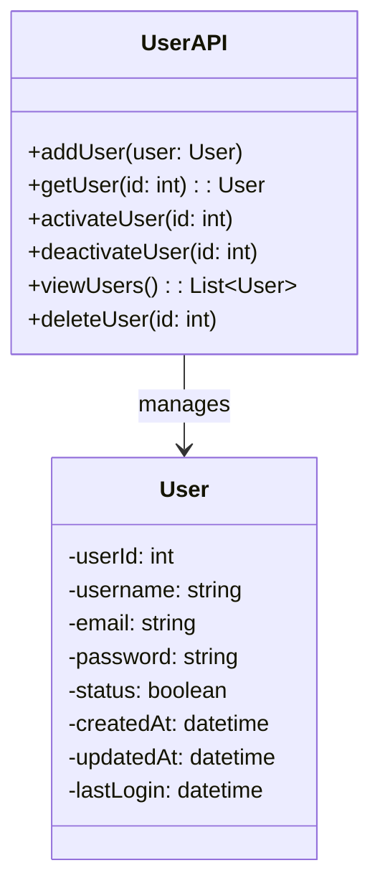
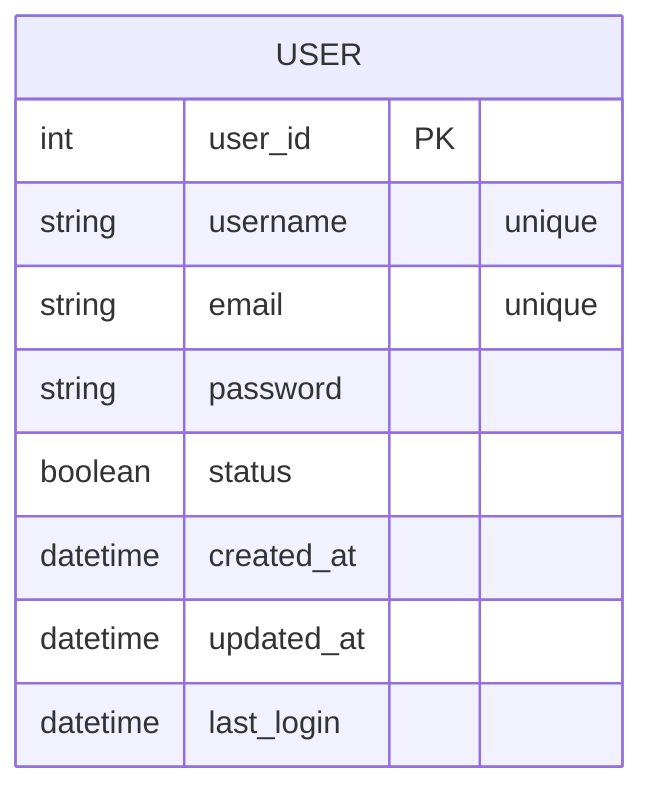

# UserAPI

UML:

```mermaid
classDiagram
    class UserAPI {
        +addUser(user: User)
        +getUser(id: int): User
        +activateUser(id: int)
        +deactivateUser(id: int)
        +viewUsers(): List~User~
        +deleteUser(id: int)
    }

    class User {
        -userId: int
        -username: string
        -email: string
        -password: string
        -status: boolean
        -createdAt: datetime
        -updatedAt: datetime
        -lastLogin: datetime
    }

    UserAPI --> User: manages
```

ERD:

```mermaid
erDiagram
    USER {
      int user_id PK
      string username "unique"
      string email "unique"
      string password
      boolean status
      datetime created_at
      datetime updated_at
      datetime last_login
    }
```
